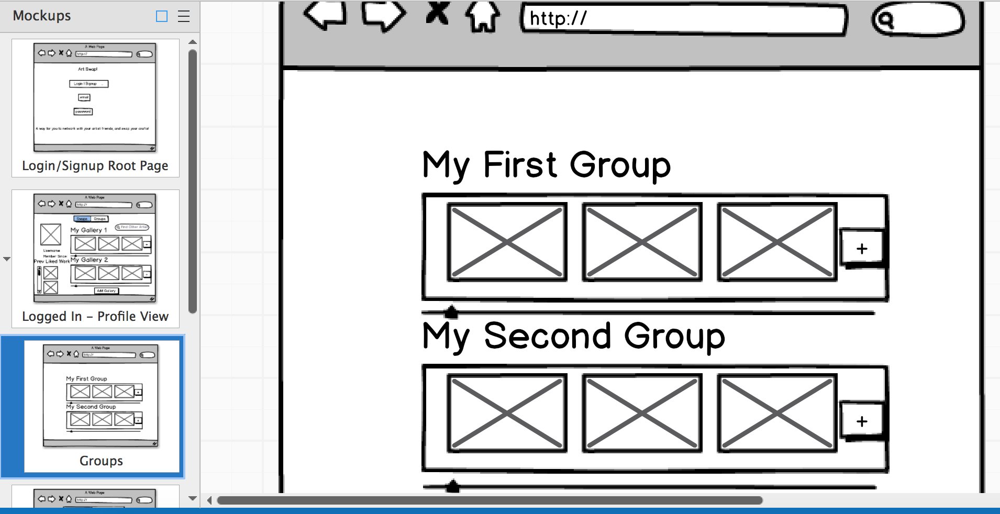
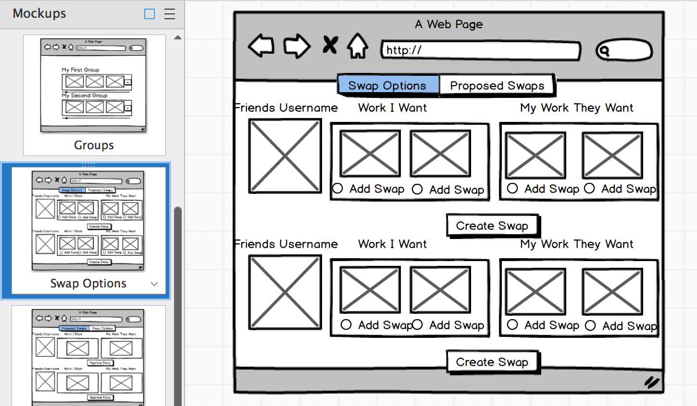

Art Swap

User Stories:
https://trello.com/b/w3V23m5A/project-4-art-trade

Data Model (or at least the original plan for it):
https://docs.google.com/spreadsheets/d/1lop39C9zDagd_ZXZiOcuTrjM7jcnvCHzlDrkJ4c9APo/edit#gid=0

Public URL (note: this project is a WIP):
https://art-swap.herokuapp.com/#/

Info:
This is my art swapping app.  The thought behind it is that there are a lot of artists out there, who have some leftover work that they would like to swap with other artists in the same situation.  Think: you have some old work that is collecting dust in your house and unfortunately isn't being enjoyed by anyone currently.  You have friends in the same situation.  Why don't you swap with them?

This project is still very much a work in progress.  Any questions, feel free to contact me at jamie.scovern@gmail.com

Mockups:

Screenshots:

Login Screen:

Profile Screen:

Groups Screen:

